 

Minimalist and platform-agnostic application layer for interactive graphical applications. 
Executables for simple applications are very small - here are the sizes of all the provided example apps:  
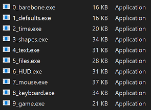  
Available as either a single header file or a directory of headers (a "unity build" setup). 
Written in plain C++. For the original C variant, see [SlimApp](https://github.com/HardCoreCodin/SlimApp) 
Focuses on simplicity, ease of use and setup with no dependencies and an optional single header file variant 
 
Used in: [SlimEngine](https://github.com/HardCoreCodin/SlimEngineCpp) and [SlimRaster](https://github.com/HardCoreCodin/SlimRasterCpp)  

For related projects, see [my portfolio](https://hardcorecodin.com/portfolio)

Architecture:
-
SlimApp is platform-agnostic by design, though currently only supports Windows. 
The platform layer only uses operating-system headers - no standard library used. 
The application layer itself has no 3rd-party dependencies - only uses standard math headers. 
It is just a library that the platform layer uses - it has no knowledge of the platform. 

More details on this architecture [here](https://youtu.be/Ev_TeQmus68).

Usage:
-
The single header file variant includes everything. 
Alternatively, specific headers can be included from the directory of headers. 
 

SlimApp comes with pre-configured CMake targets for all examples. 
For manual builds on Windows, the typical system libraries need to be linked 
(winmm.lib, gdi32.lib, shell32.lib, user32.lib) and the SUBSYSTEM needs to be set to WINDOWS 

All examples were tested in all combinations of: 
Compiler: MSVC, MinGW, CLang 
Language: C++ 
CPU Arch: x86, x64 

Features:
-

Well documented example applications cover the features:  

* <b><u>Barebone Application:</b></u>  
    
  All features are opt-in, only the entry point needs to be defined.  
  It just needs to return a pointer to an instance of a SlimApp derived class:  
  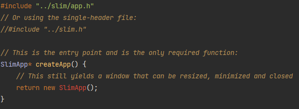  
  On its own that yield a valid application with a well-behaved blank window.  
   

* <b><u>Overridable Defaults: </b></u>  
    
  Initial dimensions and title:  
  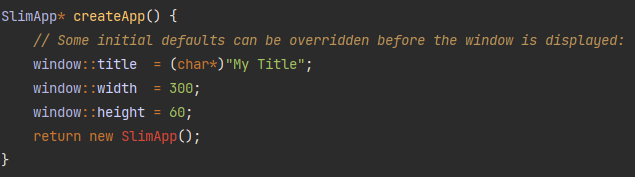  
   

* <b><u>Timers:</b></u>  
    
  To customize application behaviours, override specific methods:  
  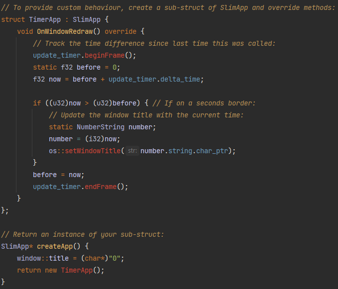  
  Timers can be used to track the time it takes to run a block of code.  
  SlimApp comes with 2 pre-exiting timers for update and render.  
   

* <b><u>Canvas</b>:</u>  
  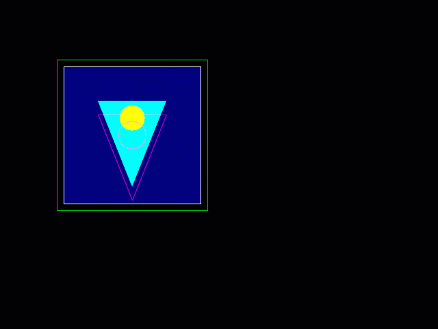 
  Canvas objects may be used for basic 2D drawing (lines, rectangles, triangles and circles):  
  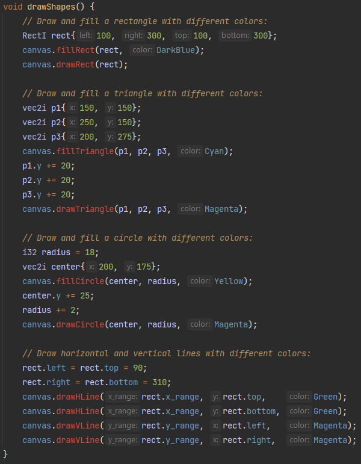  
  Canvas objects needs to be manually cleared and drawn to the window, as well as be resized along with it:  
  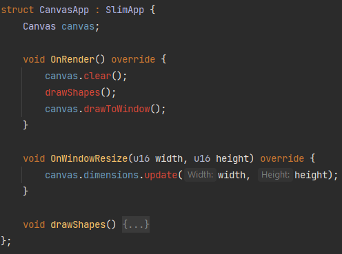  
   

* <b><u>Text</b>:</u>  
    
  String and numbers can be drawn as text:  
  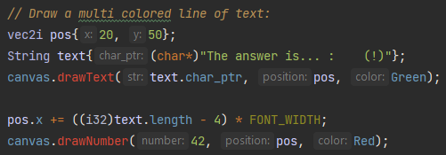  
   

* <b><u>Files I/O</b>:</u>  
  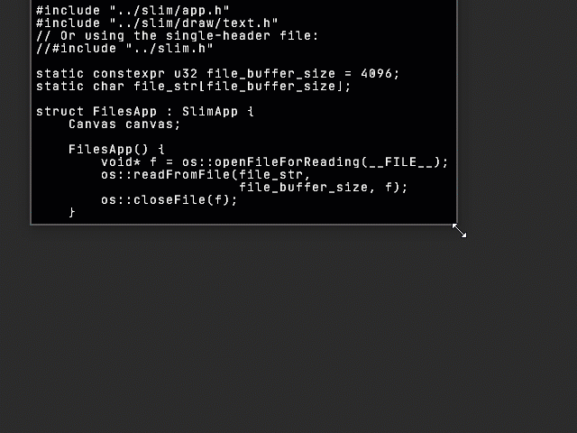  
  Files can be read-from and written-to in a platform-agnostic way:  
  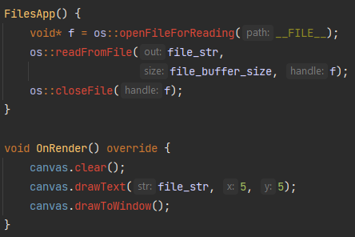  
   
 
* <b><u>HUD:</b></u>  
  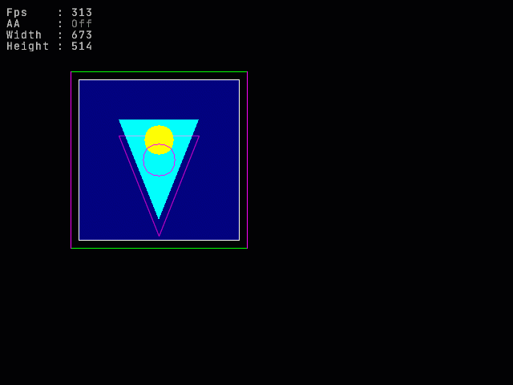  
  A heads-up display (HUD) can be set-up for showing textual overlay information.  
  HUDs contain a table of lines with Title and Value columns:   
  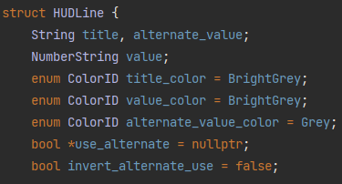  
  Values can be numeric or strings and can be bound to a boolean for toggling  
  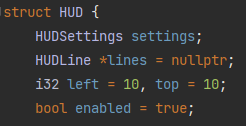  
  Line height and text color can be controlled globally or per line  
  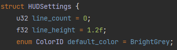  
  A typical setup might look like this:  
  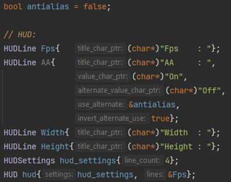  
  Updating the values may look like this:  
  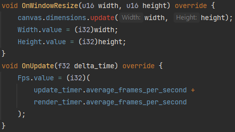  
  Toggled rendering might look like this:  
    
   

* <b><u>Mouse</b>:</u>  
  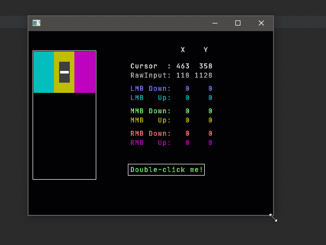  
  Mouse input tracks buttons and the wheel, as well as cursor position and movement:  
  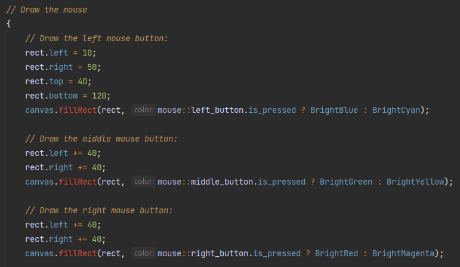  
  Raw mouse input also tracks mouse movement outside the window:    
    
   

* <b><u>Keyboard</b>:</u>  
  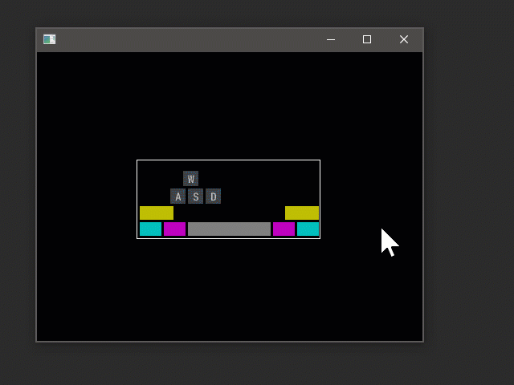  
  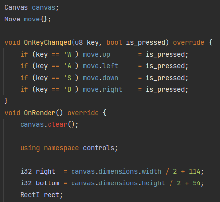  
  General key tracking + built-in tracking of control keys status (Ctrl, Alt, Shift, Space):  
  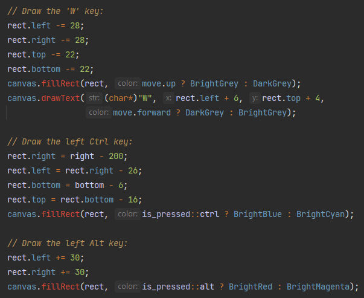  
   

* <b><u>Game</b>:</u>  
  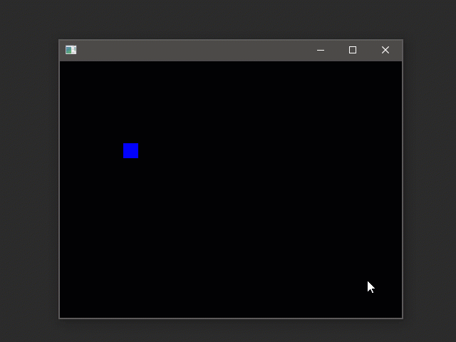  
  Update and Render loop for game-like programming:  
  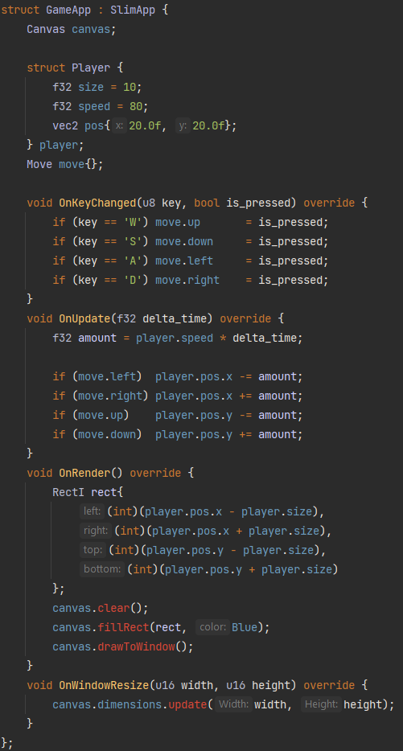  
   
 
<b>SlimApp</b> does not come with any GUI functionality at this point. 
Some example apps have an optional HUD that shows additional information. 
It can be toggled on or off using the`tab` key. 
